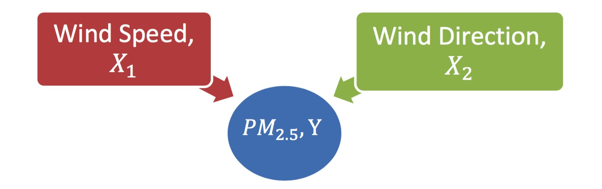

```{r 'prep', eval=TRUE, echo=FALSE} 
# load in the R objects needed for the report.
load(file="data/SEB113_CSA_Objects.RData")

# load required libraries, notice the library function has been wrapped in the `supressPackageStartupMessages` function so that R does not return anything in its console.
suppressPackageStartupMessages(library(knitr))
suppressPackageStartupMessages(library(openair))
suppressPackageStartupMessages(library(stargazer))

# for citation
suppressPackageStartupMessages(library(knitcitations))
cleanbib()

# force r codes to softwrap
opts_chunk$set(tidy.opts=list(width.cutoff=60))
```


## 1. Aim {-}
<!-- 0.5 pp -->
<!-- Criterion: Question, need and context -->
<!-- 7: Clear and compelling statement of the question, that is very strongly connected to the need and the context. -->
### Question
<!-- What is the scientific question being addressed? (1-2 sentences) Provide a concise statement of it. -->
What influence do meteorological measurements such as wind speed and wind direction have on the quality of air, particularly concentrations of PM2.5?

***
## 2. Methods {-}
<!-- 1-2 pp, may include diagrams -->
<!-- Criterion: Scientific conceptual model and quantitative model, linked to data -->
<!-- 7: Concise and logical presentation of models, with excellent visual presentations that add insight, followed by explicit and well-defined linkage to measurements and design. -->
### The scientific conceptual model
<!-- Is there a general theory being tested in a specific situation? Or is this a pioneering analysis? -->


### Diagram
<!-- Draw a conceptual model diagram showing how your variables of interest are related. Write a brief description (2-4 sentences) of how and why you believe the explanatory variables may influence the response variable (cite any publications you use). -->
```{r, echo=FALSE, fig.cap='Global average across Oceean Health Index goals.', fig.width=5, fig.height=5}
library(DiagrammeR)
grViz("
  digraph {
    # layout of the graph, 'dot'
    layout = dot

    # Properties of node A, PM 2.5
    node [shape = oval,
          style = filled,
          fontname = Helvetica,
          color = white,
          fillcolor = Salmon,
          label='PM 2.5, Y',
          fontcolor = white]
    A

    # Properties of node B, Wind Speed
    node [shape = rectangle,
          fontname = Helvetica,
          color = black,
          fillcolor = CornflowerBlue,
          label='Wind Speed, X1',
          fixedsize = true, 
          width = 1.8]
    B
    
    # Properties of node C, Wind direction
    node [shape = rectangle,
          fontname = Helvetica,
          fillcolor = LightCyan,
          label='Wind Direction, X2',
          fontcolor = black]
    C
    
    # color of arrow
    edge [color = grey]
    # Relationship between 3 nodes
    {B C} -> A 
  }", width = 250)
```


**Figure 1: Visual conceptual model of how PM2.5 concentration in the air varies according to wind speed and wind direction.**


As with other meteorological conditions, the explanatory variables, wind speed and wind direction are believe to have play an important role on direct or indirect correlation with the dispersion of air pollutant (e.g. PM2.5) concentration in the air ([@Dawson2007], [@Elminir2005225]) (Dawson et al., 2007; Elminir, 2005). 

For instance, if there is a forest fire happening at the south west of our current location, a gust of south western wind with the right speed will certainly bring the pollutant, therefore increase the pollutant concentration in the air. Vice versa, wind from other direction with certain speed could also carry away and disperse pollutants in the air.

There is no specified functional form from a scientific law to describe the influence of wind speed and wind direction affect the concentration of PM2.5 in the air, so linear terms is used in this model.


### The quatitative model
<!-- Specify how each element of the scientific conceptual model is to be quantified, whether it is a variable or fixed in the experiment. Express the model in words and in an equation. Use the model as a basis for selecting the measurements and the experimental design. Provide a clear statement of the quantitative methods to be used. -->

$$
\begin{aligned}
  log PM2.5_{i} &= \sum_{j=1}^{J} \beta_{j} \cdot I\left(WD_{i} = j\right) + \sum_{k=1}^{K} \beta_{k} \cdot WS_{i} \cdot I\left(WD_{i} = k\right) + \epsilon_{i}\\
  \epsilon_{i} &\sim N(0,\sigma^{2})
\end{aligned}
$$

Variables:

- $log PM2.5_{i}$: $i$ th observation of log PM2.5
- $WS_{i}$: Wind speed value for observation $i$
- $WD_{i}$: Wind direction value for observation $i$
- $J$ & $K$: Total number of wind direction, 8 (e.g. N, NE, E, SE, S, SW, W, NW)
- $I\left(\cdot\right)$: an indicator variable that tell us whether or not the statement inside (that Wind Direction has a particular value) is true.


#### Formulate a hypothesis:
$$
\begin{aligned}
H_0 : \beta_1 &= 0\\
H_1 : \beta_1 &\neq 0
\end{aligned}
$$  


***
## 3. Data {-}
<!-- CSV file -->
<!-- <1 pp for data in article -->
<!-- remainder up to 3 pages -->
<!-- Criterion: Effective reporting of data -->
<!-- 7: Comprehensive, accurate and ethical reporting of data, data dictionary and metadata. Excellent visualizations and other exploratory data analysis have been used. -->
### Preparation
<!-- for analysis. eg transformation of variables, how outliers were treated, adjusting by an offset, or focusing on part of the data (<1 pp) -->


### Dataset
<!-- included in a separate file in CSV format (must contain all data). Also include R code for reading data in. An extract of data should be included in the article (up to 1 pp); -->


### Data dictionary
<!-- list each variable, a description, units, permissible range and any transformation required; -->
**Data dictionary - variables**

Abbreviation  | Variable  | Description | Units
------------- | ------------- | ------------- | -------------
ws  | Wind speed  | blabla  | blabla
wd  | Wind Direction  | blabla  | blabla
wd.label | Content  | blabla  | blabla
pm2.5 | Content  | blabla  | blabla

Table: Analysis of Deviance Table

**Data dictionary - experimental units measured**

Variable  | Description  | Values | Population | Sampled
------------- | ------------- | ------------- | ------------- | -------------
ws  | Wind speed  | blabla  | blabla  | blabla
wd  | Wind Direction  | blabla  | blabla  | blabla
wd.label | Content  | blabla  | blabla  | blabla
pm2.5 | Content  | blabla  | blabla  | blabla


The data set comprises time series of: wind speed and direction; temperature; relative humidity; rainfall; barometric pressure; oxides of nitrogen; sulfur dioxide; PM10 / PM2.5 readings; and visibility-reducing particles. 
All updated hourly over the period from 1st January to 31st December 2015, recorded at Clinton, Gladstone Queensland (Latitude: -23.8701; Longitude: 151.2216).

The dataset is released under a Creative Commons Attribution 3.0 Australia (CC BY) licence.
[](https://creativecommons.org/licenses/by/3.0/au/).


### Metadata 
<!-- including source (custodian), experimental design and accuracy. -->

***
## 4. Analysis {-}
<!-- ~3 pp -->
<!-- Criterion: Quantitative methods for data analysis -->
<!-- 7: Highly skilful, appropriate application of quantitative methods. -->
### Exploratory data analysis
<!-- Numerical and graphical summary of data prior to quantitative analysis. Include histograms of key variables (1-2 pp). -->

```{r , echo=FALSE, results='asis'}
knitr::kable(head(mtcars), caption = "Title of the table")
```


### Quantitative analysis 
<!-- A large component of the report that, similar to the Problem-Solving tasks, provides working behind the Quantitative Methods. It is crucial that output (graphical or otherwise) from R is included then cited in text (2-4pp).  -->


#### Formulate a ANOVA hypothesis:
$$
\begin{aligned}
H_0 : \beta_1 &= 0\\
H_1 : \beta_1 &\neq 0
\end{aligned}
$$  

#### Interpretation of ANOVA for regression models
The p value from this hypothesis test therefore represents the probability of obtaining an F statistic at least as big as what was seen if the restricted model explained the same amount of variation as the full model. 

Rejecting the null hypothesis leads us to conclude that the inclusion of the extra terms in the full model explains more variation than if we had not included these terms.

The sum of square of the errors (residual sum of squares) for model 5?
```{r}
sum(residuals(lm.pm_wswd.forR2)^2)
```

There are `` residual degrees of freedom for the model 5?


The sum of square of the errors (residual sum of squares) for the model involving wind direction.
```{r}
sum(residuals(lm.pm_wd_wswd.forR2)^2)
```

```{r}
anova(lm.pm_wswd.forR2, lm.pm_wd_wswd.forR2)
```


### Estimate model parameters
<!-- Provide estimates together with confidence intervals and relevant hypothesis tests. Include Rcode used. -->


```{r 'dataframe', eval=FALSE, echo=TRUE}
head(air.quality.clinton)
```

```{r 'dataframe1', eval=TRUE, echo=FALSE, tidy=TRUE}
stargazer(head(air.quality.clinton), type="text", summary=FALSE, title="Have a look on first few rows of data", align=TRUE)
```


### Assess model fit
<!-- Use a goodness-of-fit statistic or other suitable measure -->

<!-- Own Note -->
<!-- r2  -->


### Model checking
<!-- Are modelling assumptions upheld or violated? (1 para) -->
<!-- IMPERATIVE: NO DUMPING OF OUTPUT! All figures and other outputs from software must be referenced in the text (summary and highlights). -->


<!-- Own Note -->
<!-- Residual checking such as: qqplot, homo plot, residual histograms, anova  -->


***
## 5. Interpret {-}
<!-- ~1 pp -->
<!-- Criterion: Interpretation of analyses, linked to Aims and Methods. -->
<!-- 7: Thorough and insightful interpretation of Quantitative analyses, which is very strongly connected to the Aims and Methods. -->
### Model interpretation
<!-- Provide a plain English interpretation that gives a holistic (overall) view of the results (1-3 paragraphs). -->


### Link back 
<!-- to the Question: provide a plain English interpretation of the model and what it means, in terms of the original question (1-2 sentences). -->


### Compare
<!-- to other relevant findings -->


```{r, echo=FALSE, fig.cap='Global average across Oceean Health Index goals.', fig.width=5, fig.height=5}
polarPlot(air.quality.clinton, pollutant = 'pm2.5', resolution="fine")
```


***


<!-- ############################################ -->

```{r 'fetchCit', echo=FALSE, results='hide', message=FALSE, warning=FALSE}
citep(citation("ggmap"))
citep(citation())
citep(citation("openair"))
```


All analyses were conducted using the statistical software program, R [@R_Core_Team_2016].

D. Kahle and H. Wickham. [@Kahle_2013]: Spatial Visualization with ggplot2

Carslaw D and Ropkins K (2016). [@Carslaw_2012]: Open-source tools for the analysis of air
pollution data.


```{r 'bib', echo=FALSE, message=FALSE}
# write the bibliography
write.bibtex(file="bib/references.bib")
```


\newpage
## References

